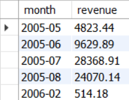
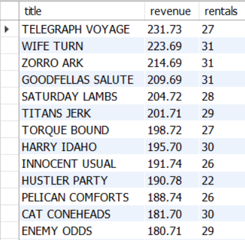
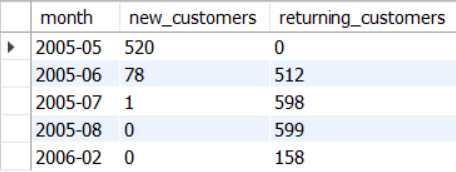

# sql-business-insights-case-study
12 business-style SQL queries on MySQL Sakila + screenshots.

2. Top categories by revenue — [SQL](./sql/02_top_categories_by_revenue.sql)  
   

3. Top films by revenue — [SQL](./sql/03_top_films_by_revenue.sql)  
   

4. Customer lifetime value — Top 15 — [SQL](./sql/04_customer_lifetime_value_top15.sql)  
   

5. New vs Returning customers by month — [SQL](./sql/05_new_vs_returning_by_month.sql)  
   
