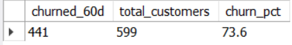
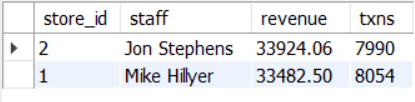
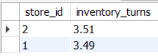
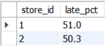
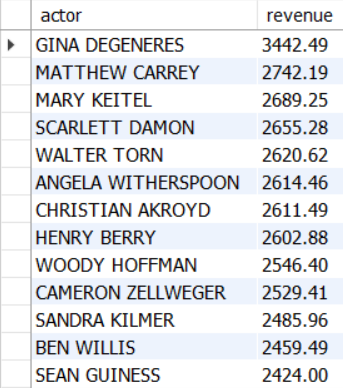
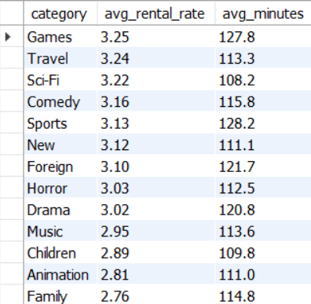

# sql-business-insights-case-study
12 business-style SQL queries on MySQL Sakila + screenshots.

2. Top categories by revenue — [SQL](./sql/02_top_categories_by_revenue.sql)  
   

3. Top films by revenue — [SQL](./sql/03_top_films_by_revenue.sql)  
   

4. Customer lifetime value — Top 15 — [SQL](./sql/04_customer_lifetime_value_top15.sql)  
   

5. New vs Returning customers by month — [SQL](./sql/05_new_vs_returning_by_month.sql)  
   

6. Churned customers (no rental in last 60 days) — [SQL](./sql/06_churned_customers_60d.sql)  
   

7. Revenue by store & staff — [SQL](./sql/07_revenue_by_store_and_staff.sql)  
   

8. Inventory turns by store — [SQL](./sql/08_inventory_turns_by_store.sql)  
   

9. Late return rate by store — [SQL](./sql/09_late_return_rate_by_store.sql)  
   

10. Actor revenue — Top 15 — [SQL](./sql/10_actor_revenue.sql)  
    

11. Category price & length profile — [SQL](./sql/11_category_price_and_length_profile.sql)  
    

