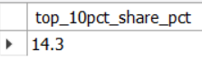

# SQL Business Insights — MySQL (Sakila)

**Deliverable:** 12 business-style SQL queries with result screenshots + concise insights.  
**Stack:** MySQL 8, MySQL Workbench

---

## Headline Insights

- **Revenue trend:** Peak **$28,368.91 (2005-07)** after launch; fades to **$514.18 (2006-02)**.
- **Acquisition vs retention:** New customers **520 → 78 → 1 → 0** (May→Aug); activity quickly becomes **returning-led**.
- **Churn risk:** **73.6%** of customers had **no rental in the last 60 days**.
- **Customer concentration:** Top **10%** of customers contribute **14.3%** of revenue.
- **Category mix (by revenue):** **Sports $5.31k**, **Sci-Fi $4.76k**, **Animation $4.66k** → prioritize stock & promos here.
- **Pricing/length profile:** Highest avg rental rates in **Games ($3.25)**, **Travel ($3.24)**, **Sci-Fi ($3.22)**; longest films in **Sports (128.2 mins)**, **Foreign (121.7)**, **Drama (120.8)**.
- **Top title:** **TELEGRAPH VOYAGE — $231.73 across 27 rentals**.
- **Store & staff:** Store **2 / Jon Stephens** **$33,924 / 7,990 txns** vs Store **1 / Mike Hillyer** **$33,482 / 8,054** → higher **AOV** at Store 2 (**~$4.25 vs ~$4.16**).
- **Ops drag:** **Late returns ~50–51%** at both stores → hurts availability, turns, and retention.

---

## Queries & Screens

1. **Monthly revenue (last 12 months)** — [SQL](./sql/01_monthly_revenue_last_12m.sql)  
   

2. **Top categories by revenue** — [SQL](./sql/02_top_categories_by_revenue.sql)  
   

3. **Top films by revenue** — [SQL](./sql/03_top_films_by_revenue.sql)  
   

4. **Customer lifetime value — Top 15** — [SQL](./sql/04_customer_lifetime_value_top15.sql)  
   

5. **New vs Returning customers by month** — [SQL](./sql/05_new_vs_returning_by_month.sql)  
   

6. **Churned customers (no rental in last 60 days)** — [SQL](./sql/06_churned_customers_60d.sql)  
   

7. **Revenue by store & staff** — [SQL](./sql/07_revenue_by_store_and_staff.sql)  
   

8. **Inventory turns by store** — [SQL](./sql/08_inventory_turns_by_store.sql)  
   

9. **Late return rate by store** — [SQL](./sql/09_late_return_rate_by_store.sql)  
   

10. **Actor revenue — Top 15** — [SQL](./sql/10_actor_revenue.sql)  
    

11. **Category price & length profile** — [SQL](./sql/11_category_price_and_length_profile.sql)  
    

12. **Top 10% customers’ revenue share** — [SQL](./sql/12_top_10pct_customers_share.sql)  
    

---

## How to run
1. Load **Sakila** into MySQL 8 (`sakila-schema.sql` then `sakila-data.sql`).  
2. Open any script in `/sql/` with **MySQL Workbench**, run, and compare with screenshots in `/images/`.

## What I’d do next
- Launch a **60-day win-back** campaign; track re-activation rate.  
- Tackle **late returns** (policy + reminders); aim to lift **inventory turns** by 5–10%.  
- Shift inventory / promos toward **Sports / Sci-Fi / Animation**.  
- Replicate **Store 2** tactics to lift **Store 1** AOV.

---
*Dataset: MySQL Sakila sample database.*
